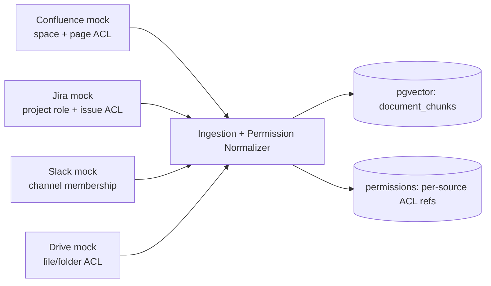
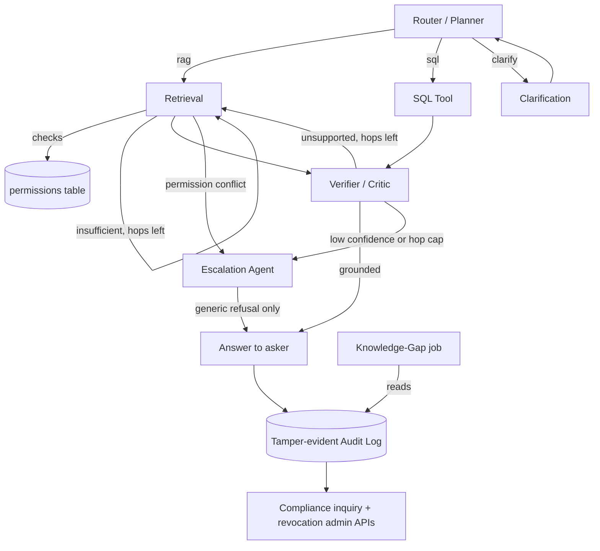

# Internal Brain — Engineering Reference

Aspire track (FinTech) · Tencent Cloud "AI CAN DO IT" Hackathon Singapore 2026.
Full design context lives in the shared doc (PRD / Decision Log / Technical Design tabs):
https://claude.ai/code/artifact/b200d4f4-3cc9-4cb3-b839-07dfb7e8e141

This file is the precise, code-facing reference for the 3-person team. It documents state, contracts,
and conventions — not rationale (see the Decision Log tab for "why").

## 1. Non-negotiable design rule

Access control is enforced as a database-level metadata filter, evaluated **before** any chunk or row
reaches an LLM. Never a prompt instruction ("don't share restricted content"). Never a post-hoc filter
on already-generated text. Any PR touching `src/agents/retrieval.py`, `src/agents/sql_tool.py`, or the
`permissions` table that weakens this gets rejected in review, no exceptions.

The authorization decision is **always re-derived from the live `permissions` table at query time**,
never cached on a chunk/row. This is what makes live permission revocation work with zero extra logic.

## 2. Architecture

### 2.1 Source integration & trust boundaries



### 2.2 Request-time flow



## 3. Graph state schema

`src/graph/state.py` — this is the single source of truth for state shape; every agent reads/writes a
subset of it, nothing more.

```python
class GraphState(TypedDict):
    request_id: str
    query: str
    user: UserContext                          # id, role, dept, clearance_level
    route: Literal["rag", "sql", "clarify", "escalate"]
    hop_count: int
    retrieved_chunks: list[Chunk]               # ACL-filtered, used for the answer
    evidence_exhausted: bool                    # this hop retrieved the same chunks as the last — stop looping
    permission_conflicts: list[PermConflict]    # restricted item ids that scored higher — never their content
    sql_result: Any | None
    draft_answer: str | None
    verification: VerificationResult | None     # grounded: bool, unsupported: list[str], confidence: float
    clarification_question: str | None
    final_answer: str | None
    citations: list[Citation]                   # resolvable source pointers backing final_answer (see §5)
    explanation: str | None                     # detailed reason when withheld/escalated — NEVER sent to the asker, only via compliance inquiry
    escalated: bool
    audit_events: list[AuditEvent]
```

`RETRIEVAL_MAX_HOPS` (default 3), `VERIFIER_CONFIDENCE_THRESHOLD`, `PERMISSION_CONFLICT_SCORE_MARGIN`
are all env-configured (`.env.example`), never hardcoded in agent modules.

## 4. Agent contracts

Convention: one module per agent under `src/agents/<name>.py`. Each module exposes a top-level
`PROMPT_TEMPLATE: str` constant (formatted with `.format(**kwargs)`, no external template engine) and,
where few-shot examples are used, a sibling `<name>_examples.py` exporting a `EXAMPLES: list[dict]`.
Keep prompts and code in the same PR — a prompt change without the code that consumes it is an
incomplete review.

### Router / Planner — `src/agents/router.py`
- In: `query`, `user`. Out: `route`.
- Few-shot classification into `rag | sql | clarify`. Dominant-intent only for compound queries — no
  sub-query splitting in MVP.

### Retrieval — `src/agents/retrieval.py`
- In: `query`, `user`, `hop_count`. Out: `retrieved_chunks`, `permission_conflicts`, `hop_count`.
- Two pgvector searches per hop: (1) ACL-filtered (predicate on `acl_tags` intersecting the caller's
  role/dept, evaluated in SQL); (2) unfiltered, used only to populate `permission_conflicts` when a
  restricted chunk scores `PERMISSION_CONFLICT_SCORE_MARGIN` above the top filtered result — id + owning
  source only, never content. Reformulates and re-runs while `hop_count < RETRIEVAL_MAX_HOPS` and the
  Verifier reports insufficient grounding.

### Clarification — `src/agents/clarification.py`
- In: `query`, Router's ambiguity signal. Out: `clarification_question`.
- One round only. Reply gets appended to `query`, control returns to Router.

### Synthesizer — `src/agents/synthesizer.py`
- In: `query`, `retrieved_chunks`, `sql_result`. Out: `draft_answer`, `citations`.
- Drafts the answer the Verifier judges. Nothing else writes `draft_answer`, and the Verifier
  takes it as an input — without this node the rag and sql paths both dead-end. Serves both,
  since a SQL result reaches the Verifier exactly like a retrieved chunk.
- Prompted to answer from the supplied evidence only, and to emit `INSUFFICIENT` rather than
  reach outside it. `INSUFFICIENT` and "no permitted evidence" both yield `draft_answer=None`,
  which the Verifier reports as ungrounded — so the hop loop and Escalation stay the only exits.
- Runs strictly after the permission-conflict check: restricted content never enters its prompt.

### Verifier / Critic — `src/agents/verifier.py`
- In: `draft_answer`, `retrieved_chunks`. Out: `verification`.
- Claim-level LLM-as-judge, structured JSON out (`grounded`, `unsupported: list[str]`, `confidence: float`).
  Unsupported + hops left → loop to Retrieval with `unsupported` as reformulation hints. Unsupported at
  hop cap, or `confidence < VERIFIER_CONFIDENCE_THRESHOLD` → hand to Escalation.

### Permission-Conflict + Escalation — `src/agents/escalation.py`
- In: `permission_conflicts`, `verification`, `user`. Out: `final_answer`, `explanation`, `escalated`,
  an `escalations` row.
- Triggers on: non-empty `permission_conflicts`; low `verification.confidence`; a matched item's
  sensitivity exceeding the caller's clearance. Writes the *specific* reason to `explanation` (goes to
  `escalations`/`audit_log` only) and a fully generic, non-revealing message to `final_answer` — **see
  §5, this split is load-bearing for the negative-case requirement.**

### Audit — `src/agents/audit.py`
- In: every state transition. Out: rows in `audit_log`.
- One row per node transition, hash-chained (§6). `request_id`-keyed. `GET /audit/{request_id}` is the
  only path that can read `explanation` back out.

### SQL Tool — `src/agents/sql_tool.py`
- In: `query`, `user`. Out: `sql_result`.
- Text-to-SQL against read-only, department-scoped views over `transactions`. No arbitrary user-supplied
  SQL is ever executed — parameterized queries built from a fixed set of templates only. Result is
  logged and handed to the Verifier exactly like a retrieved chunk.

### Knowledge-Gap — `src/agents/knowledge_gap.py`
- In: `audit_log` (batch, out of band). Out: a gap report.
- `run_knowledge_gap_scan(since: datetime) -> GapReport`. Embeds recent low-confidence/escalated query
  text (same Hunyuan embeddings as retrieval), clusters by cosine distance (no training), LLM-summarizes
  each cluster. Exposed via `GET /knowledge-gaps`.

### Ingestion connectors — `src/connectors/`
- One `SourceConnector` protocol, four mock implementations (`confluence.py`, `jira.py`, `slack.py`,
  `drive.py`):

```python
class SourceConnector(Protocol):
    platform: Literal["confluence", "jira", "slack", "drive"]
    def list_items(self) -> list[SourceItem]: ...
    def permissions_for(self, item: SourceItem) -> NativePermission: ...
    def check_access(self, user: UserContext, item: SourceItem) -> bool: ...
```

`NativePermission` is a tagged union — `ConfluencePermission(space, page, viewer_groups)`,
`JiraPermission(project, issue, role_required)`, `SlackPermission(channel, is_private, member_ids)`,
`DrivePermission(file_id, folder_id, acl_entries)`. `check_access` runs at ingest time only, to compute
the normalized `acl_tags` written to `document_chunks` — never cached as the authorization decision
itself (§1).

## 5. Two-tier refusal contract

```python
def build_response(state: GraphState) -> AskerResponse:
    if state.escalated:
        return AskerResponse(text="I don't have an answer you're permitted to see for this request.")
    return AskerResponse(text=state.final_answer, citations=state.citations)

def build_audit_explanation(request_id: str) -> ComplianceExplanation:
    # only reachable via the compliance-officer-authenticated endpoint
    ...
```

`state.explanation` must never appear in an `AskerResponse`. If you're tempted to add detail to the
asker-facing refusal "to be more helpful," don't — that's the exact failure mode the brief's negative
case tests for.

## 6. Tamper-evident audit log

```sql
ALTER TABLE audit_log ADD COLUMN prev_hash CHAR(64);
ALTER TABLE audit_log ADD COLUMN row_hash  CHAR(64) NOT NULL;
-- row_hash = SHA-256(prev_hash || request_id || event_type || payload || created_at)
```

Single-writer hash chain, not a blockchain — no consensus needed. `verify_audit_chain()` walks the table
and flags the first row whose `row_hash` doesn't match. This check must exist and be demoable
(tamper a row → run the checker → see it flagged) before code freeze.

## 7. Naming conventions

- Python modules: `snake_case.py`, one agent per file under `src/agents/`.
- Branches: `retrieval/*`, `orchestration/*`, `audit/*` — matches the three workstreams (§8).
- Env vars: `SCREAMING_SNAKE_CASE`, declared in `.env.example` before use, never hardcoded.
- API routes: `POST /query`, `GET /audit/{request_id}`, `GET /knowledge-gaps`, admin revoke under
  `POST /admin/permissions/revoke`.
- Prompt constants: `PROMPT_TEMPLATE` (module-level, in the agent's own file), examples in
  `<agent>_examples.py` as `EXAMPLES`.

## 8. Workstream ownership

| Workstream | Owner | Key paths |
| --- | --- | --- |
| Retrieval + vector store + ingestion | Chris | `src/connectors/`, `src/ingestion/`, `src/agents/retrieval.py`, `src/db/schema.sql` (documents/chunks/permissions) |
| Orchestration + verifier + SQL tool | Clement | `src/graph/`, `src/config.py`, `src/agents/router.py`, `src/agents/clarification.py`, `src/agents/synthesizer.py`, `src/agents/verifier.py`, `src/agents/sql_tool.py` |
| Audit + escalation + knowledge-gap + compliance/admin | Jin Hui | `src/agents/escalation.py`, `src/agents/audit.py`, `src/agents/knowledge_gap.py`, `src/api/compliance.py` |

Shared files (`src/llm/factory.py`, `src/api/main.py`, `.env.example`, this file) — flag in the team
channel before editing, since all three workstreams depend on them.

## 9. Process requirement (don't skip this)

CodeBuddy or WorkBuddy must actually be used during the build, with 3+ screenshots/recordings as proof —
this is a mandatory deliverable, worth losing real points if missed. Grab screenshots as you go, not
scrambled together the night before submission.
