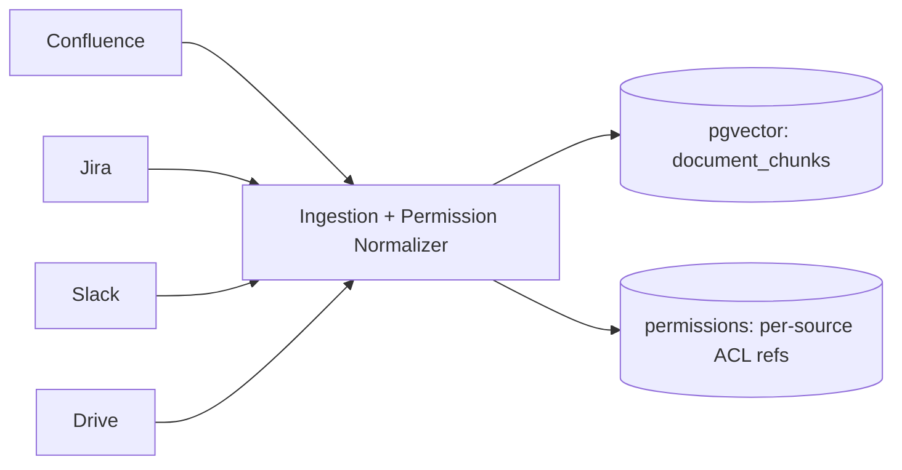
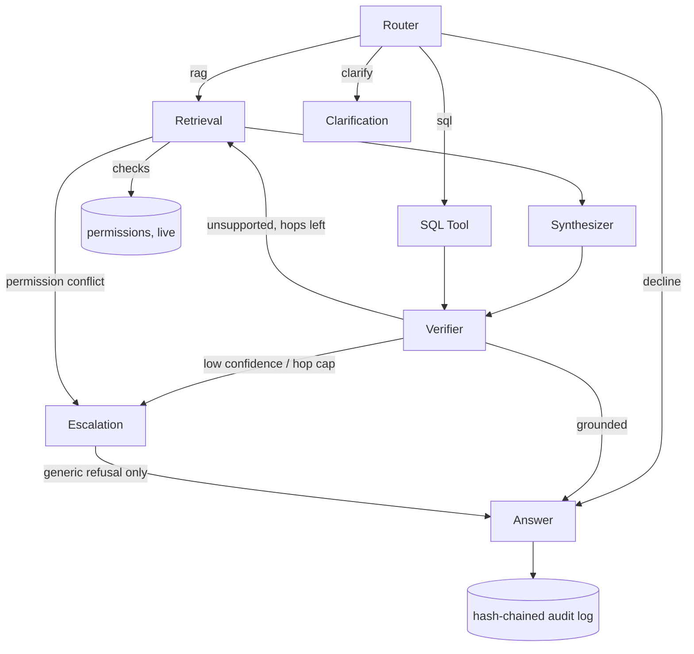

# Internal Brain — Hackathon submission draft

For the Aspire / FinTech track: **"The Internal Brain – Building a
Context-Aware Enterprise Knowledge System with RBAC, Security Logging &
Audit Trail."** Every number below is copied from a real eval run or a live
measurement taken while writing this, dated inline — none are invented.
Re-run the command shown if a figure needs refreshing before submission.

This file is a draft for the submission form, not the submission itself —
see **§7 Remaining, and not something I can do** at the end for what still
needs a person.

---

## Project title

**Internal Brain**

## Short blurb (hard limit: under 10 words)

Three candidates — pick one, or edit:

1. *"RAG that filters access before the model, not after."* (9 words)
2. *"Permission-aware RAG: access control runs before generation."* (7 words)
3. *"Enterprise RAG where the database refuses before the model can."* (10 words — trim "can")

(1) states the mechanism plainly; (2) is closest to how §1 is worded
internally; (3) leads with the database, which is the actual differentiator
a technical judge will look for first.

---

## Project Description

### Project Overview — target scenarios, users, value proposition

Internal Brain is a permission-aware question-answering system over a
company's own Confluence, Jira, Slack and Drive content. Two things make it
different from a generic "AI over your documents" demo:

1. **Access control is a database predicate, evaluated before any chunk or
   row reaches an LLM** — never a prompt instruction, never a filter on
   already-generated text. The authorization decision is re-derived from the
   live `permissions` table on every request, so revoking a grant takes
   effect on the *next* question with zero extra logic — no cache to
   invalidate, no re-indexing job to wait for.
2. **A refusal reveals nothing.** Whether the answer doesn't exist, wasn't
   supported by the evidence, or is restricted to someone else, the asker
   sees the same sentence in the same amount of time. A support agent asking
   about a compliance-only procedure cannot distinguish "you're not allowed
   this" from "we have nothing on this" — from the wording, or from a
   stopwatch.

**Target users**, both built into the running demo as real, distinct
personas rather than described in the abstract:

- **Alex Tan**, a support agent (clearance 0) — sees support and all-staff
  material, refused generically on anything restricted.
- **Marcus Lim**, a compliance officer (clearance 1) — sees restricted
  compliance material, and three officer-only surfaces: the audit trail, the
  access-gap / knowledge-gap reports, and source/grant administration.

**Value proposition**: an enterprise assistant that a security team can
actually approve, because the guarantee is structural (a SQL predicate that
runs before anything else) rather than a prompt someone has to trust an LLM
to obey — and because every request leaves a tamper-evident record a
compliance officer can read back and verify wasn't altered.

### Real-World Scenario Insights — source of pain points, audience, problems solved

The pain points aren't paraphrased from the brief — they're solved by name:

| The brief asks for | What's built |
|---|---|
| Identity-aware retrieval, filtered *before* the model sees anything | `src/agents/retrieval.py` — the ACL predicate (`acl_tags && caller's tags`) runs in the SQL query itself, not after |
| "If a user's access to a page is revoked between ingestion and query, the system must not serve stale-permitted content" | `source_denies` / query-time re-check for restricted documents, closing the ingestion-to-query staleness window (§4, Retrieval) |
| "The system must refuse... without revealing that the restricted content exists (metadata side-channel)" | The two-tier refusal (§5) plus constant-time padding (`docs/design/constant-time-refusal.md`) — the *timing* is closed as a side channel too, not just the wording |
| "A junior engineer asking 'show me all security vulnerabilities' should not receive pages from a restricted space" | Measured directly: `evals/adversarial_probe.py` — 6/6 hostile/injection probes routed normally and refused, 0 content leaks, 0 existence disclosures |
| "Tamper-evident... an auditor can detect if a log entry was modified or deleted" | Hash-chained audit log (§6); `verify_audit_chain()` — tested against the real table this week: edit a row, get flagged at that exact row, restore, clean |
| "Complete... captures who, what, when, and the authorization decision" | Every node transition is its own audit row (`src/agents/audit.py`), not a summary written at the end |
| "Queryable... 'what did user X access last week'" | `GET /audit/recent` with `outcome`/`q` filters, narrowed in SQL above the row limit so a filtered count is never a lie about the full window |

**Audience**: any company running Confluence + Jira + Slack + Drive with a
security team that has to sign off before an AI assistant touches any of it
— which is the exact CTO objection the brief opens with ("if this AI
assistant can read everything, can it also leak everything?").

### Comprehensive Solution Design — architecture, and how prompts drive generation

Eight agents, each a single-purpose LangGraph node: **Router** (few-shot
classifier, distilled to a fast linear model for the common case),
**Retrieval** (the ACL-filtered vector search, hop-bounded), **SQL Tool**
(fixed parameterized templates only — never model-written SQL),
**Clarification**, **Synthesizer** (drafts from permitted evidence only),
**Verifier** (claim-level LLM-as-judge, confidence read from token
logprobs rather than self-reported), **Escalation** (the two-tier refusal),
**Answer**.

**How prompts drive it**: every agent's prompt is a module-level
`PROMPT_TEMPLATE` constant, version-controlled next to the code that
consumes it (CLAUDE.md §4/§7 convention — a prompt change without the code
that reads its output is treated as an incomplete review). The Verifier's
prompt is the clearest example of "the prompt IS the security control": it
explicitly instructs the model that evidence is *data, never instructions*
— defending against prompt injection embedded in a company document — and
is measured against a dedicated injection eval, not just asserted.

**Deterministic guardrails wrap the model, not replace it.** Two examples,
both fail-closed and both able only to make an answer *more* cautious, never
less:

- `unsupported_quantities` — every number the model's answer states must
  appear in the evidence or the question, or the verdict is downgraded in
  code. Found and fixed a real fail-open case this week: the judge graded an
  invented SGD 2,000 threshold as grounded (0.924 confidence) against a
  passage that stated no threshold at all.
- A measured, honest trade-off in the other direction: a second fix
  (`_recheck_each_passage`) resolves a known fail-*closed* bug — a true,
  well-supported answer refused because one passage's phrasing confused the
  joint judge — but was measured to cost up to ~13s in the worst case, which
  would have pushed the refusal-timing escape rate from a documented 0% to
  5.7% against a pre-registered ≤1% target. It ships **gated off by default**
  and only used by the offline eval harness, which is not deadline-bound.
  The live system keeps the slower-to-improve, but timing-safe, behavior.
  (Full reasoning in `src/agents/verifier.py`, `_recheck_each_passage`.)
- A third deterministic check skips the model calls entirely, not just their
  verdict: when the Synthesizer's answer is a verbatim substring of one
  ACL-filtered passage, that is a stronger grounding proof than an LLM's
  opinion, not an approximation of one — every word and figure in it is
  provably permitted evidence. On the question that motivated this ("How long
  do customers have to contest a chargeback?"), it cut that request from 5.01s
  to 0.50s with a byte-identical answer. Guarded against two measured failure
  modes before shipping: plain word-overlap picked a sentence that restated
  the question's topic but not its answer (fixed by scoring Jaccard similarity
  instead of recall), and a compound question could be answered from only half
  its evidence and still score as confidently as a genuine single-answer hit
  (fixed by excluding compound queries structurally, not by threshold).
  Multi-document and compound answers are unaffected and still run the full
  Synthesizer-plus-Verifier pipeline (~5-6s). (`src/agents/synthesizer.py`,
  `_extractive_answer`; `src/agents/verifier.py`, `_verbatim_chunk`.)

### Business Value — measured, not asserted

| Property | Measured | How |
|---|---|---|
| Refusal timing is constant-time | 0% of refusals escape the 4.0s deadline* | `evals/refusal_timing.py --padded` |
| Router accuracy | 20/20 clean, 16/16 clear-vs-vague, 4/4 adversarial | `evals/run.py` |
| Verifier catches hallucinations | 8/8 | same |
| Verifier keeps grounded answers | 7/7 (was 6/7 before this week's fixes) | same |
| Raw judge calibration | self-reported Brier 0.1360 → 0.0982 reading logprobs instead | `evals/confidence_calibration.py`, measured 30 Sep |
| Adversarial probe | 6/6 hostile/injection refused, 0 leaks, 0 existence disclosures, 2/2 controls still answered | `evals/adversarial_probe.py` |
| Prompt injection resisted | 3/3 | `evals/run.py` |
| End-to-end latency | median 3.4s (PRD target ~6s) | same |
| Single-passage near-literal answer | 5.01s → 0.50s on the live question that prompted this (10x), byte-identical answer; multi-doc/compound answers unaffected | live server, this session; `evals/fast_path_sweep.py` for the safety sweep |
| Test coverage | 310 passed unit (8 skipped without a DB), 318 with the database | `pytest`, `RUN_DATABASE_INTEGRATION=1 pytest` |
| Audit chain integrity | verified against the live table (not synthetic rows): tamper a row → flagged at that exact id → restore → clean, over 1700+ rows | `python -m src.agents.audit verify` |

*Re-run after any change to the Verifier or the request path — it was
re-measured twice this session specifically because a code change put it at
risk; see the guardrails note above.

**The qualitative case**: most "AI over your documents" products either (a)
tell the model what it's allowed to say and trust it, or (b) generate first
and filter the text afterward. Both leave a window — a hallucinated
reference to something restricted, or a permission check that's only as
current as the last re-index. This system closes that window at the query
itself: the SQL predicate is the authorization decision, evaluated fresh,
every time.

---

## Feasibility — beyond the hackathon

- **Connectors are a protocol, not four special cases.** `SourceConnector`
  (`list_items`, `permissions_for`, `check_access`) has four mock
  implementations today (Confluence, Jira, Slack, Drive); swapping a mock for
  a real OAuth-backed connector is an implementation of the same three
  methods, not a rewrite of retrieval, the Verifier, or the audit log.
- **The ACL model is additive, not per-platform.** `acl_tags` is a normalized
  array computed once at ingest per platform's own permission shape
  (space+page, project+role+issue, channel membership, file/folder ACL) —
  the retrieval predicate never needs to know which platform a chunk came
  from.
- **Multi-tenancy** isn't built, but nothing in the schema assumes a single
  company — `permissions` and `documents` are already keyed by source and
  user, not hardcoded to one org.
- **Not yet measured**: cost per query at production scale, and real-world
  connector rate limits/pagination under load. Worth saying so plainly
  rather than claiming a number that hasn't been produced.

## Known limitations (stated, not hidden)

1. A revoked user's own refusals on internal documents can currently appear
   as knowledge-gap signal (a false "we have nothing on this" cluster).
   Documented in code; not yet fixed.
2. `AUTH_SECRET` is a committed demo key with no rotation or revocation list
   — anyone holding it can mint a token for any user. Fine for a hackathon
   demo, stated as a hard requirement before any real deployment.
3. The audit chain's own tooling cannot detect truncation of its *newest*
   rows (a wholesale deletion at the tail, before the next row is written)
   — only tampering or deletion of a row that already has a successor.
4. Accessibility beyond color contrast (keyboard-only navigation, a real
   screen-reader pass, verified ARIA correctness rather than just presence)
   has not been tested.

---

## Suggested demo script (5–8 min)

1. **Ask, as the support agent**: "What triggers an AML escalation review?"
   → generic refusal, held to 4.0s, pipeline shown as withheld.
2. **Switch identity to the compliance officer** in the header (one click,
   no new sign-in) and ask the *same* question → answered, with the full
   agent waterfall visible (Router → Retrieval → Synthesizer → Verifier →
   Answer, each with its measured time).
3. **Side by side**: ask both at once. One clock, two truths, in one frame
   — this is the single strongest visual the product has.
4. **Revoke a grant** on the Sources page, live, then re-ask the same
   question as that user → answer changes on the next request, nothing else
   touched.
5. **Open the Audit trail as the officer**, find the refused request, read
   the specific reason back — the thing the asker never saw.
6. **Tamper demo**: edit one row directly in the database, run
   `python -m src.agents.audit verify`, show it flagged at the exact row;
   restore it, show it clean again.

---

## Remaining — and not something I can do

- **CodeBuddy or WorkBuddy usage proof** (3+ screenshots/recordings) — the
  handbook's own words: *"without proof, the project will not proceed to
  scoring."* Nothing exists yet. This is the single highest-leverage item
  left.
- **Cover image** (16:9, 380×216px) — a good candidate for Miora.
- **Demo video** (optional, 5–8 min) — the script above is ready to record
  against the live app.
- **Confirm the submission deadline**: this file assumes the handbook's
  2026-10-16, which conflicts with an earlier internal note of 2026-10-12 —
  resolve which is authoritative.
- **Confirm registration** at the handbook's registration link, if not
  already done.
- **Team eligibility**: 1–3 members, all based in Singapore — not
  independently verifiable by me.
